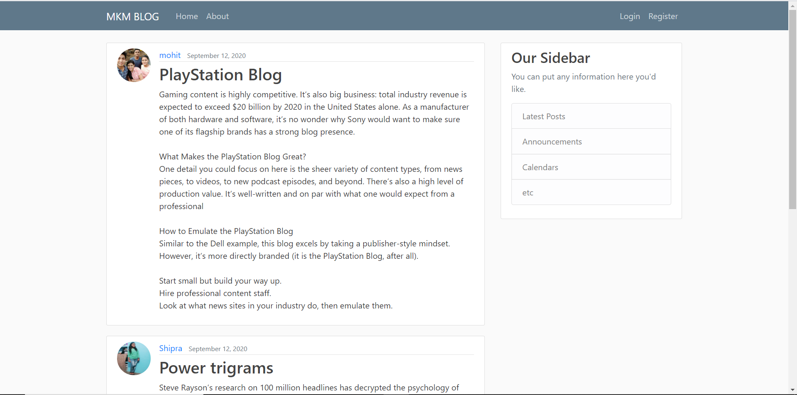

<!DOCTYPE html>
<html lang="en">

<head>
    <meta charset="utf-8">
    <meta content="width=device-width, initial-scale=1.0" name="viewport"> Mohit Kumar Mandhre
    <title>MKM-Portfolio-Website</title>
    <meta content="" name="description">
    <meta content="" name="keywords">

    <!-- Google Fonts -->
    <link href="https://fonts.googleapis.com/css?family=Open+Sans:300,300i,400,400i,600,600i,700,700i|Raleway:300,300i,400,400i,500,500i,600,600i,700,700i|Poppins:300,300i,400,400i,500,500i,600,600i,700,700i" rel="stylesheet">

    <!-- Vendor CSS Files -->
    <link href="assets/vendor/bootstrap/css/bootstrap.min.css" rel="stylesheet">
    <link href="assets/vendor/icofont/icofont.min.css" rel="stylesheet">
    <link href="assets/vendor/boxicons/css/boxicons.min.css" rel="stylesheet">
    <link href="assets/vendor/venobox/venobox.css" rel="stylesheet">
    <link href="assets/vendor/owl.carousel/assets/owl.carousel.min.css" rel="stylesheet">
    <link href="assets/vendor/aos/aos.css" rel="stylesheet">

    <!-- Template Main CSS File -->
    <link href="assets/css/style.css" rel="stylesheet">

</head>

<body>

    <!-- ======= Mobile nav toggle button ======= -->
    <button type="button" class="mobile-nav-toggle d-xl-none"><i class="icofont-navigation-menu"></i></button>

    <!-- ======= Header ======= -->
    <header id="header">
        

            

                
                <h1 class="text-light"><a href="index.html">Mohit Ku. Mandhre</a></h1>
                

                    <a href="https://github.com/MohitKumarMandhre" class="twitter"><i class="bx bxl-github"></i></a>
                    <a href="https://join.skype.com/invite/Uy3XlH0UpN34" class="google-plus"><i class="bx bxl-skype"></i></a>
                    <a href="https://www.linkedin.com/in/mohit-kumar-mandhre-ab451b190/" class="linkedin"><i class="bx bxl-linkedin"></i></a>
                

            

            <nav class="nav-menu">
                <ul>
                    <li class="active"><a href="index.html"><i class="bx bx-home"></i> Home</a></li>
                    <li><a href="#about"><i class="bx bx-user-pin"></i> About</a></li>
                    <li><a href="#testimonials"><i class="bx bxs-graduation"></i> Education</a></li>
                    <li><a href="#skills"><i class="bx bxs-star"></i> Skills</a></li>
                    <li><a href="#facts"><i class="bx bx-user"></i> Experiences</a></li>
                    <li><a href="#resume"><i class="bx bx-file-blank"></i> Resume</a></li>
                    <li><a href="#portfolio"><i class="bx bx-book-content"></i> Portfolio</a></li>
                    <li><a href="#contact"><i class="bx bx-envelope"></i> Contact</a></li>

                </ul>
            </nav>
            <!-- .nav-menu -->
            <button type="button" class="mobile-nav-toggle d-xl-none"><i class="icofont-navigation-menu"></i></button>

        

    </header>
    <!-- End Header -->

    <!-- ======= Hero Section ======= -->
    <section id="hero" class="d-flex flex-column justify-content-center align-items-center">
        

            <h1>Mohit Kumar Mandhre</h1> 
            
• I'm a 

            
• Ex-SDET at <b><a href="https://www.replicon.com/">Replicon Inc (Time Intelligence Company)</a></b>.

        

    </section>
    <!-- End Hero -->

    <main id="main">

        <!-- ======= About Section ======= -->
        <section id="about" class="about">
            

                

                    <h2>About</h2>
                    <h5><b>• To secure a challenging position in a reputable organization to expand my learning, knowledge, and technical-skills. I’m also interested in Computer-Vision and Machine Learning.</b></h5>
                

                

                    <!-- 

                        
                    
 -->
                    

                        <h6>
                            
➡ Hi, I am Mohit Kumar Mandhre. I have 0-1 year of experience as an Software-Engineer-Trainee at Replicon Inc (Time Intelligence Company).

                            
➡ I love building things. While hard engineering problems are often fun to tackle. I love problem solving.

                            
➡ I am looking for a Software Development Engineer (SDE) role where I can grow my knowledge & skills and at the same time apply the experience that I possess.

                        </h6>
                         

                        

                            

                                <ul>
                                    <li><i class="icofont-rounded-right"></i> <strong>Birthday:</strong> 23 Feb, 1999</li>
                                    <li><i class="icofont-rounded-right"></i> <strong>Phone:</strong> +91 8349729606</li>
                                    <li><i class="icofont-rounded-right"></i> <strong>City:</strong> Durg-Bhilai, C.G</li>
                                </ul>
                            

                            

                                <ul>
                                    <li><i class="icofont-rounded-right"></i> <strong>Age:</strong> 22</li>
                                    <li><i class="icofont-rounded-right"></i> <strong>Degree:</strong> BTech from SSEC, Bhilai</li>
                                    <li><i class="icofont-rounded-right"></i> <strong>Email Id:</strong> mohitmandhre@gmail.com</li>
                                </ul>
                            

                        

                    

                

            

        </section>
        <!-- End About Section -->

        <!-- ======= education Section ======= -->
        <section id="testimonials" class="testimonials section-bg">
            

                

                    <h2>Education</h2>
                

                

                    

                        

                            <i class="bx bxs-quote-alt-left quote-icon-left"></i>
                            <b>
                                BTech ( Honours ) from Shri Shankaracharya Engineering College, Graduation Percentage :- 83 %, CPI :- 9.2.
                              </b>
                            <i class="bx bxs-quote-alt-right quote-icon-right"></i>
                        

                        
                        <h3>Computer Science Engineering (2016-2020)</h3>
                        <h4><b>SSEC, Bhilai</b></h4>
                    

                    

                        

                            <i class="bx bxs-quote-alt-left quote-icon-left"></i>
                            <b>
                              HSSC from CBSE-Board with 74 % in PCM+ PE(Physics, Chemistry, Maths + Physical Education) background.
                            </b>
                            <i class="bx bxs-quote-alt-right quote-icon-right"></i>
                        

                        
                        <h3>HSSC (2015-2016)</h3>
                        <h4><b>DAV PUBLIC SCHOOL</b></h4>
                        <h6>Hudco, Bhiali</h6>
                    

                    

                        

                            <i class="bx bxs-quote-alt-left quote-icon-left"></i>
                            <b>
                              SSC from CBSE-Board with 9.2 CPI.
                            </b>
                            <i class="bx bxs-quote-alt-right quote-icon-right"></i>
                        

                        
                        <h3>SSC (2013-2014)</h3>
                        <h4><b>DAV PUBLIC SCHOOL</b></h4>
                        <h6>Hudco, Bhiali</h6>
                    

                

            

        </section>
        <!-- End education Section -->

        <!-- ======= Skills Section ======= -->
        <section id="skills" class="skills section-bg">
            

                

                    <h2>Skills</h2>
                    <!-- <b> -->
                    
<b>➡ Programming Language :- </b>C , C++, C#, Core-Java, JavaScript, Python 

                     
                    
<b>➡ Data Management :- </b>RDBMS, MySQL, MongoDB, PostgreSQL, SQLite

                     
                    
<b>➡ Web Development :- </b>HTML, CSS, BOOTSTRAP 

                     
                    
<b>➡ Frameworks & Libraries :- </b>Django, Reactjs, .NET, Flutter, Git, AppVeyor, Jenkins, Docker, Launch Darkely, Nodejs

                    <!-- </b> -->
                

            

        </section>
        <!-- End Skills Section -->

        <!-- ======= Experiences Section ======= -->
        <section id="facts" class="facts">
            

                

                    <h2>Experiences</h2>
                    <h3>• Ex-SDET at Replicon Inc (Time Intelligence Company) <b>(Internship)</b><a href="https://drive.google.com/file/d/1V1vMG__Q7AO6_41ixWWk28sexRrYnwXG/view"> [link]</a></h3>
                    

                        Was associated with Replicon as a Trainee-Software-Engineer, assisted the Site-Reliability-Team(SRE) in the development part.
                    

                

                

                

                <b>
                  
➡ Assist the Site-Reliability-Team with specifications, development, software-design, proposals, test-plans, documentations and implementing features.

                  
➡ Work closely with team in early product phase to facilitate agile development methodology.

                  
➡ Hands-On experience of working with JIRA, Version Control, CI/CD Tools & Package Management.

                </b>
            

        </section>
        <!-- End Facts Section -->

        <!-- ======= Resume Section ======= -->
        <section id="resume" class="resume">
            

                

                    <h2>Resume</h2>
                     
                    <embed src="assets/MohitKumarMandhre56.pdf" type="application/pdf" height="900px" width="1000">
                

            

        </section>
        <!-- End Resume Section -->

        <!-- ======= Portfolio Section ======= -->
        <section id="portfolio" class="portfolio section-bg">
            

                

                    <h2>Portfolio</h2>
                

                

                    

                        <ul id="portfolio-flters">
                            <li data-filter="*" class="filter-active">All</li>
                            <li data-filter=".filter-app">Python-Django</li>
                            <li data-filter=".filter-web">Apps or Web Apps</li>
                            <li data-filter=".filter-card">ML and OpenCV</li>
                        </ul>
                    

                

                

                    

                        

                            
                            

                                <a href="assets/img/portfolio/django-blog.png" data-gall="portfolioGallery" class="venobox" title="App 1"><i class="bx bx-search"></i></a>
                                <a href="https://github.com/MohitKumarMandhre/Django-Blogging_App" title="More Details"><i class="bx bx-link"></i></a>
                            

                        

                    

                    

                        

                            
                            

                                <a href="assets\img\portfolio\react-rest.gif" data-gall="portfolioGallery" class="venobox" title="Web 3"><i class="bx bx-search"></i></a>
                                <a href="https://github.com/MohitKumarMandhre/React-Projects" title="More Details"><i class="bx bx-link"></i></a>
                            

                        

                    

                    

                        

                            
                            

                                <a href="assets\img\portfolio\django-ecom.png" data-gall="portfolioGallery" class="venobox" title="App 2"><i class="bx bx-search"></i></a>
                                <a href="https://github.com/MohitKumarMandhre/E-COMMERCE-WEB-APPLICATION" title="More Details"><i class="bx bx-link"></i></a>
                            

                        

                    

                    

                        

                            
                            

                                <a href="assets\img\portfolio\ml-att.png" data-gall="portfolioGallery" class="venobox" title="Card 2"><i class="bx bx-search"></i></a>
                                <a href="https://github.com/MohitKumarMandhre/Face-Recognition-Based-Smart-Attendance-System" title="More Details"><i class="bx bx-link"></i></a>
                            

                        

                    

                    

                        

                            
                            

                                <a href="assets\img\portfolio\react-whe.gif" data-gall="portfolioGallery" class="venobox" title="Web 2"><i class="bx bx-search"></i></a>
                                <a href="https://github.com/MohitKumarMandhre/React-Projects" title="More Details"><i class="bx bx-link"></i></a>
                            

                        

                    

                    

                        

                            
                            

                                <a href="assets\img\portfolio\django-pur.png" data-gall="portfolioGallery" class="venobox" title="App 3"><i class="bx bx-search"></i></a>
                                <a href="https://github.com/MohitKumarMandhre/Purchase_Request_Management" title="More Details"><i class="bx bx-link"></i></a>
                            

                        

                    

                    

                        

                            
                            

                                <a href="assets\img\portfolio\ml-drum.gif" data-gall="portfolioGallery" class="venobox" title="Card 1"><i class="bx bx-search"></i></a>
                                <a href="https://github.com/MohitKumarMandhre/ML-bat-drum-game" title="More Details"><i class="bx bx-link"></i></a>
                            

                        

                    

                    

                        

                            
                            

                                <a href="assets\img\portfolio\ml-music.png" data-gall="portfolioGallery" class="venobox" title="Card 3"><i class="bx bx-search"></i></a>
                                <a href="https://github.com/MohitKumarMandhre/MKM_Music_Player" title="More Details"><i class="bx bx-link"></i></a>
                            

                        

                    

                    

                        

                            
                            

                                <a href="assets\img\portfolio\django-news.gif" data-gall="portfolioGallery" class="venobox" title="App 4"><i class="bx bx-search"></i></a>
                                <a href="https://github.com/MohitKumarMandhre/Purchase_Request_Management" title="More Details"><i class="bx bx-link"></i></a>
                            

                        

                    

                    

                        

                            
                            

                                <a href="assets\img\portfolio\react-keep.png" data-gall="portfolioGallery" class="venobox" title="Web 4"><i class="bx bx-search"></i></a>
                                <a href="https://github.com/MohitKumarMandhre/MKM_Keep_App" title="More Details"><i class="bx bx-link"></i></a>
                            

                        

                    

                    

                        

                            
                            

                                <a href="assets\img\portfolio\django-email.png" data-gall="portfolioGallery" class="venobox" title="App 4"><i class="bx bx-search"></i></a>
                                <a href="https://github.com/MohitKumarMandhre/MKM_email_posts_Webapp" title="More Details"><i class="bx bx-link"></i></a>
                            

                        

                    

                    

                        

                            
                            

                                <a href="assets\img\portfolio\flutter-covid.jpg" data-gall="portfolioGallery" class="venobox" title="Web 1"><i class="bx bx-search"></i></a>
                                <a href="https://github.com/MohitKumarMandhre/Covid-19-Cases-Tracker-App" title="More Details"><i class="bx bx-link"></i></a>
                            

                        

                    

                

            

        </section>
        <!-- End Portfolio Section -->

        <!-- ======= Services Section ======= -->
        <!-- <section id="services" class="services">
            

                

                    <h2>Services</h2>
                

                

                    

                        
<i class="icofont-computer"></i>

                        <h4 class="title"><a href="">BTech from SSEC, Bhiali</a></h4>
                        
Computer Science Engineering , Graduation Percentage :- 82.65 % , CPI :- 9.2

                    

                    

                        
<i class="icofont-chart-bar-graph"></i>

                        <h4 class="title"><a href="">Dolor Sitema</a></h4>
                        
Minim veniam, quis nostrud exercitation ullamco laboris nisi ut aliquip ex ea commodo consequat tarad limino ata

                    

                    

                        
<i class="icofont-earth"></i>

                        <h4 class="title"><a href="">Sed ut perspiciatis</a></h4>
                        
Duis aute irure dolor in reprehenderit in voluptate velit esse cillum dolore eu fugiat nulla pariatur

                    

                    

                        
<i class="icofont-image"></i>

                        <h4 class="title"><a href="">Magni Dolores</a></h4>
                        
Excepteur sint occaecat cupidatat non proident, sunt in culpa qui officia deserunt mollit anim id est laborum

                    

                    

                        
<i class="icofont-settings"></i>

                        <h4 class="title"><a href="">Nemo Enim</a></h4>
                        
At vero eos et accusamus et iusto odio dignissimos ducimus qui blanditiis praesentium voluptatum deleniti atque

                    

                    

                        
<i class="icofont-tasks-alt"></i>

                        <h4 class="title"><a href="">Eiusmod Tempor</a></h4>
                        
Et harum quidem rerum facilis est et expedita distinctio. Nam libero tempore, cum soluta nobis est eligendi

                    

                

            

        </section> -->
        <!-- End Services Section -->

        <!-- ======= Contact Section ======= -->
        <section id="contact" class="contact">
            

                

                    <h2>Contact</h2>
                

                

                    

                        

                            

                                <i class="icofont-google-map"></i>
                                <h4>Location:</h4>
                                
MIG-1/63 Aditya Nagar, Durg

                            

                            

                                <i class="icofont-envelope"></i>
                                <h4>Email:</h4>
                                
mohitmandhre@gmail.com

                            

                            

                                <i class="icofont-phone"></i>
                                <h4>Call:</h4>
                                
+91 8349729606

                            

                            <iframe src="https://www.google.com/maps/embed?pb=!1m14!1m8!1m3!1d12097.433213460943!2d-74.0062269!3d40.7101282!3m2!1i1024!2i768!4f13.1!3m3!1m2!1s0x0%3A0xb89d1fe6bc499443!2sDowntown+Conference+Center!5e0!3m2!1smk!2sbg!4v1539943755621" frameborder="0"
                                style="border:0; width: 100%; height: 290px;" allowfullscreen></iframe>
                        

                    

                    

                        <form action="forms/contact.php" method="post" role="form" class="php-email-form">
                            

                                

                                    <label for="name"><b>Your Name</b></label>
                                    <input type="text" name="name" class="form-control" placeholder="Enter your name here" id="name" data-rule="minlen:4" data-msg="Please enter at least 4 chars" />
                                    

                                

                                

                                    <label for="name"><b>Your Email</b></label>
                                    <input type="email" class="form-control" name="email" placeholder="Enter your mail-id here" id="email" data-rule="email" data-msg="Please enter a valid email" />
                                    

                                

                            

                            

                                <label for="name"><b>Subject</b></label>
                                <input type="text" class="form-control" name="subject" id="subject" placeholder="Add your subject here" data-rule="minlen:4" data-msg="Please enter at least 8 chars of subject" />
                                

                            

                            

                                <label for="name"><b>Message</b></label>
                                <textarea class="form-control" name="message" rows="10" placeholder="Add your content/query here" data-rule="required" data-msg="Please write something for us"></textarea>
                                

                            

                            

                                
Loading

                                

                                
Your message has been sent. Thank you!

                            

                            
<button type="submit"><b>Send Message</b></button>

                        </form>
                    

                

            

        </section>
        <!-- End Contact Section -->

        <!-- ======= education Section ======= -->
        <section id="testimonials" class="testimonials section-bg">
            

                

                    

                        <a href="https://github.com/MohitKumarMandhre">
                            

                                <b>
                                    
                                </b>
                            

                            
                            <h3>GitHub</h3>
                        </a>

                    

                    

                        <a href="https://www.linkedin.com/in/mohit-kumar-mandhre-ab451b190/">
                            

                                <b>
                                    
                                </b>
                            

                            
                            <h3>Linkedln</h3>
                        </a>
                    

                    

                        <a href="mailto:mohitmandhre@gmail.com">
                            

                                <b>
                                    mohitmandhre@gmail.com
                                </b>
                            

                            
                            <h3>Gmail</h3>
                        </a>
                    

                    

                        

                            <b>
                                    +91 8349729606
                                </b>
                        

                        
                        <h3>Mobile Number</h3>
                    

                    

                        <a href="https://join.skype.com/invite/Uy3XlH0UpN34">
                            

                                <b>
                                    
                                </b>
                            

                            
                            <h3>Skype</h3>
                        </a>
                    

                

            

        </section>
        <!-- End education Section -->

    </main>
     
     
    <!-- End #main -->

    <!-- ======= Footer ======= -->
    <footer id="footer">
        

            

                &copy; Copyright <strong> MKM </strong>
            

            

                Designed by <a href="https://www.linkedin.com/in/mohit-kumar-mandhre-ab451b190/">MKM</a>
            

        

    </footer>
    <!-- End  Footer -->

    <a href="#" class="back-to-top"><i class="icofont-simple-up"></i></a>

    <!-- Vendor JS Files -->
    
    
    
    
    
    
    
    
    
    
    

    <!-- Template Main JS File -->
    

</body>

</html>
